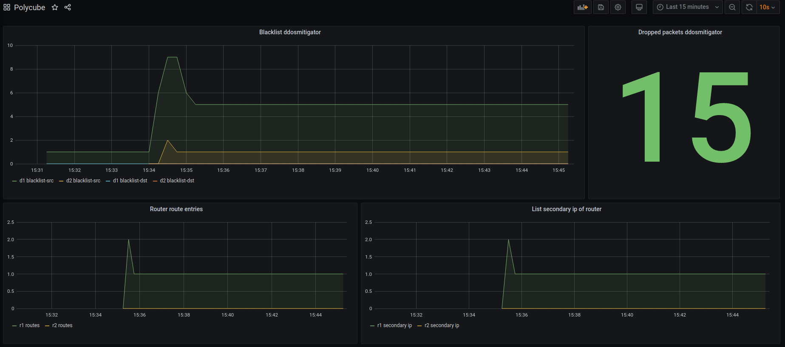

View metrics
=================================

Raw metrics
-----------

To see the raw metrics just run polycube and go to http://localhost:9000/polycube/v1/metrics, 
every time this page is refreshed, the metrics are updated, reading the cubes in run. Something like this::

    #HELP ddos_stats_pkts_packets Total Dropped Packets
    #TYPE ddos_stats_pkts_packets counter
    ddos_stats_pkts_packets{cubeName="d1"} 4.000000
    ddos_stats_pkts_packets{cubeName="d2"} 0.000000
    #HELP ddos_blacklist_src_addresses Number of addresses in blacklist-src
    #TYPE ddos_blacklist_src_addresses gauge
    ddos_blacklist_src_addresses{cubeName="d1"} 3.000000
    ddos_blacklist_src_addresses{cubeName="d2"} 0.000000
    #HELP ddos_blacklist_dst_addresses Number of addresses in blacklist-dst
    #TYPE ddos_blacklist_dst_addresses gauge
    ddos_blacklist_dst_addresses{cubeName="d1"} 0.000000
    ddos_blacklist_dst_addresses{cubeName="d2"} 0.000000

Something more interesting
--------------------------

To make graphs based on metrics and/or also to query metrics extracted from cubes

1. download Prometheus (follow the information on the `official page <https://prometheus.io/docs/introduction/first_steps/>`_) and edit the file "prometheus.yml"
     1. modify the part of static_configs, removing the targets and adding this:
     ::

        - targets: ['localhost: 9000']
      metrics_path: '/polycube/v1/metrics'
     

     2. to launch Prometheus just go to the Prometheus folder and 
     ::
     
     ./prometheus --config.file = prometheus.yml
     
  3. Now you can go to http://localhost:9090/graph

It is also possible to use Grafana, just follow the `official documentation <https://grafana.com/docs/grafana/latest/getting-started/getting-started/>`_ and set Prometheus as a datasource. 

This is an example screenshot:

