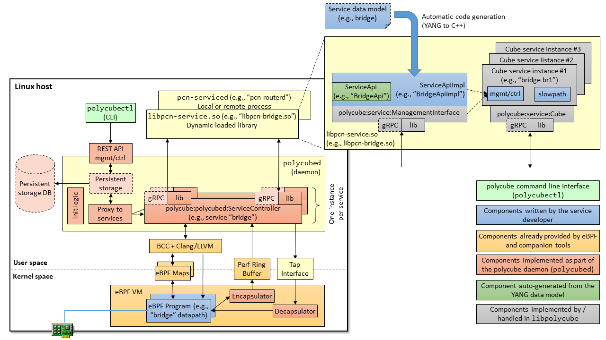

Polycube Architecture
=====================

The Polycube architecture is depicted below:

The architecture includes four main components: `polycubed`: a service-agnostic daemon to control the polycube service, a set of `polycube services`, which actually implement the network functions, `polycubectl`, a service-agnostic CLI that allows to interact with polycube and all the available services, and `libpolycube`, a library that keeps some common code to be reused across multiple network functions.

polycubed
---------
**polycubed** is the main component of the polycube architecture.
It is a service-agnostic daemon that allows to control the entire polycube service, such as starting, configuring and stopping all the available network functions (a.k.a., `services`). This module acts mainly as a proxy: it receives a request from its northbound REST interface, it forwards it to the proper service instance, and it returns back the answer to the user.

Polycube supports both **local** services, implemented as shared libraries, which are installed in the same server of `polycubed` and whose interaction is through direct calls, and **remote** services, implemented as remote daemons possibly running on a different machine, which communicate with `polycubed` through gRPC. Polycubed hides the above details and allow to get access to any registered service, either local or remote, in the same way from its REST interface.
For the same reason, a service will be able to interact to the  `polycubed` daemon independently from the fact that the service itself is remote or local, hence facilitating the service developer who does not have to deal with the low-level details of the communication with the daemon.

Polycube services
-----------------
Polycube implements a flexible architecture that supports multiple services (a.k.a., `network functions` such as bridge, router, NAT, etc.), not known a-priori. Polycube services are similar to `plug-ins` that can be installed and launched at run-time. Obviously, each service has to implement a specific interface to be recognized and controlled by polycubed.

Each network function is implemented as a separated module and multiple flavors of the same function can coexist, such as in case of a simple (and fast) version to be used when speed is important and a reduced set of features can suffice, while a more complete (but slower) version can be used in other cases.

Each service implementation includes the `datapath`, namely the eBPF code to be injected in the kernel, the `control/management plane`, which defines the primitives that allow to configure the service behavior, and the `slow path`, which handles packets that cannot be fully processed in the kernel. While the former code runs in the Linux kernel, the latter components are executed in user-space.
Given the feature-rich nature of the eBPF, the slow path should be rather small; an example can be the implementation of the spanning tree for 802.1Q bridges, which does not make sense to have in the kernel and that can stay in user space.

Polycubectl
-----------
This module implements the service-agnostic command-line interface (CLI) that allows to control the entire system, such as starting/stopping services, creating service instances (e.g., bridges `br1` and `br2`), and configuring / querying the internals of each single service (e.g., enabling the spanning tree on bridge `br1`).

As in case of `polycubed`, this module cannot know, a priori, which service will have to control; hence its internal architecture (not detailed here for the sake of brevity) is service-agnostic, meaning that is able to interact with any service through well-defined control/management interface that has to be implemented in each service.
In order to facilitate the programmer in creating polycube services with the proper interface, we provide a set of automatic code generation tools that can create the skeleton of the control/management interface starting from the YANG data model of the service itself.

libpolycube
-----------
This library contains some common code that can be reused across multiple network functions.
In facilitates the creation of links between services (i.e., to create a `service chain`), it provides common primitives such as a logging system, it facilitates the access to eBPF maps, and more.
This library leverages [BCC](https://github.com/iovisor/bcc/) for compiling and injecting eBPF programs into the kernel.
