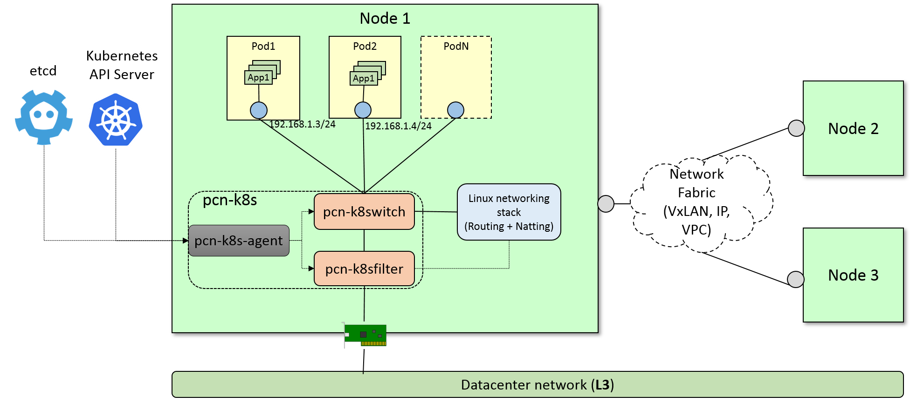

pcn-k8s: A pod network provider for kubernetes
==============================================

``pcn-k8s`` leverages some polycube services to provide network support for pods running in Kubernetes.
It supports the `cluster Kubernetes networking model <https://kubernetes.io/docs/concepts/cluster-administration/networking/>`_, ``ClusterIP`` and ``NodePort`` services.
Security policies and ``LoadBalancing`` service mode are not yet supported.

``pcn-k8s`` is made of 3 components:

- The ``pcn-k8s-agent``, which interfaces with the Kubernetes API master service and dynamically reconfigures the networking components in order to create the network environment required by Kubernetes and provide connectivity to the pods.
- The ``pcn-cni`` plugin implements CNI specification, it connects new pods to the ``pcn-k8s`` networking.
- ``pcn-k8switch`` and ``pcn-k8sfilter`` two polycube services that implement an eBPF datapath for kubernetes pod networking.

Networking Mode
---------------

The ``pcn-k8s`` solution supports different methods to communicate pods running in different hosts

- **overlay networking**: when nodes are on different subnets and the user does not have direct control over the physical network an overlay networking is used. The default (and only supported yet) technology is ``VxLAN``
- **direct routing**: when nodes are on the same subnet packets can be exchanged between nodes without encapsulating them
- **vpc**: when nodes run on a cloud provider that supports Virtual Private Cloud (VPC). As of today only `aws` is supported.

See `Configuring pcn-k8s`_ to get more info about how to configure the different modes.

Installation:
-------------
You may choose either of the below options.

1. Quick setup with ``vagrant`` (development environment)
2. Using ``kubeadm`` on Bare-Metal or VMs (Single or HA cluster)

1. Quick Setup with ``vagrant``
-------------------------------
- The fastest mode to test ``pcn-k8s`` including setup.

**Pre-requisite:**

Download and set up the following packages.

- `Vagrant <https://www.vagrantup.com/downloads.html>`_ (Tested on 2.2.4)
- `VirtualBox <https://www.virtualbox.org/wiki/Downloads>`_ (Tested on 6.0.4)

**Follow the instruction below, after the pre-requisite:**

1. Use this `PCN-K8S Vagrantfile <https://raw.githubusercontent.com/polycube-network/polycube/master/tests/vagrant/pcn-k8s/Vagrantfile>`_ for your setup.
2. Execute ``vagrant up`` to bring all the nodes up and running.
3. ``vagrant status`` to check all the nodes and it's status
4. ``vagrant ssh <node-name>`` to SSH to the node.

Note: This vagrant setup takes care of setting up the kubeadm and joining the nodes along with the ``pcn-k8s`` CNI.

2. Using ``kubeadm`` on Bare-Metal or VMs (Single or HA cluster)
----------------------------------------------------------------

The easiest way to get started with ``pcn-k8s`` using ``kubeadm``.

Please follow the `kubeadm installation guide <https://kubernetes.io/docs/setup/independent/install-kubeadm/>`_ for the most up-to-date instructions.

Once ``kubeadm`` is installed, you can create the cluster.
The following commands are intended to be used as a quick guide; please refer to the official `single cluster setup guide <https://kubernetes.io/docs/setup/independent/create-cluster-kubeadm/>`_ or `HA cluster setup guide <https://kubernetes.io/docs/setup/independent/high-availability/>`_ for more detailed information.

Initialize master
^^^^^^^^^^^^^^^^^

First, you have to initialize the master by specifying the set of network addresses to be used for pods, such as the following:

::

    sudo kubeadm init --pod-network-cidr=192.168.0.0/16

    # In case you're using a multi-cloud cluster or your master has a
    # PUBLIC IP/FQDN you may use the below command instead:
    # (Replace the --apiserver-cert-extra-sans value with External IP or FQDN)
    sudo kubeadm init --pod-network-cidr=192.168.0.0/16 \
        --apiserver-cert-extra-sans="Master External IP or FQDN"

This step will print on screen a command like:

::

    kubeadm join --token <token> <master-ip>:<master-port> \
        --discovery-token-ca-cert-hash sha256:<hash>

Please save the ``kubeadm join ...`` command that is printed on screen, which will be used to join the workers nodes later.

::

    mkdir -p $HOME/.kube
    sudo cp -i /etc/kubernetes/admin.conf $HOME/.kube/config
    sudo chown $(id -u):$(id -g) $HOME/.kube/config

Verify that the system pods are in running state before continuing:

::

    kubectl get pods --all-namespaces

You should see something like:

::

    NAMESPACE     NAME                                 READY     STATUS    RESTARTS   AGE
    kube-system   etcd-k8s-master                      1/1       Running   0          1m
    kube-system   kube-apiserver-k8s-master            1/1       Running   0          1m
    kube-system   kube-controller-manager-k8s-master   1/1       Running   0          1m
    kube-system   kube-dns-545bc4bfd4-czf84            0/3       Pending   0          1m
    kube-system   kube-proxy-hm4ck                     1/1       Running   0          1m
    kube-system   kube-scheduler-k8s-master            1/1       Running   0          1m

``pcn-k8s`` requires an ``etcd`` deployment to work, set the ``etcd_url`` parameter in :scm_raw_web:`pcn-k8s.yaml <src/components/k8s/pcn-k8s.yaml>`.
:scm_raw_web:`standalone_etcd.yaml <src/components/k8s/standalone_etcd.yaml>` provides a basic etcd service that can be used for testing, deploy it before deploying pcn-k8s.

At this point you can install ``pcn-k8s``:

.. parsed-literal::

    kubectl apply -f |SCM_RAW_WEB|/src/components/k8s/pcn-k8s.yaml
    # It will take some time until the images are pulled.

    # Optional: if you want to execute pods on the master node
    kubectl taint nodes --all node-role.kubernetes.io/master-

Add workers
^^^^^^^^^^^
Workers can be added by executing the previously saved ``kubeadm join`` command on each new node, as shown in this example (please note that the actual command will be different on your system):

::

    sudo kubeadm join --token 85856d.feb1e886dd94f7d5 130.192.225.143:6443 \
        --discovery-token-ca-cert-hash sha256:2c3f07b126bdc772e113306f1082ece6c406f130704a1e08a9c67c65542b869d

You can see all the nodes in the cluster using the following command:

::

    kubectl get nodes -o wide

After that, the cluster will be ready to accept requests and deploy pods.

Removing ``pcn-k8s``
^^^^^^^^^^^^^^^^^^^^

In order to remove ``pcn-k8s`` execute on the master node:

.. parsed-literal::

    kubectl delete -f |SCM_RAW_WEB|/src/components/k8s/pcn-k8s.yaml

Testing pcn-k8s
---------------

Please refer to :doc:`testing <testing>` to learn how to deploy and test some basic services.

Configuring pcn-k8s
-------------------

``pcn-k8s`` uses ``etcd`` to save the different configuration parameters.
It is exposed at port `30901` of the master node if you used the `standalone_etcd.yaml` template to deploy it.

Installing etcdctl
^^^^^^^^^^^^^^^^^^

The easiest way to get ``etcdctl`` is to download a `etcd release <https://github.com/etcd-io/etcd/releases>`_ and take the binary from there.

The different per-node parameters that the user can configure are:

- **directRouting (boolean)**: when this is enabled ``pcn-k8s`` will avoid to create tunnels among adjacent nodes (nodes that are on the same subnet).

example:

::

    ETCDCTL_API=3 etcdctl --endpoints=130.192.225.145:30901 \
        put /nodes/node1/directRouting true

Note that in order to use that feature `directRouting` must be enabled in both nodes.

- **vpcMode**: specifies the kind of Virtual Provide Cloud where the node is running in. When this is set to a value provider (only `aws` is supported now) it configures the VPC and avoid creating tunnels to other nodes running on the same VPC. If this is empty, the vpc support is disabled.

::

    ETCDCTL_API=3 etcdctl --endpoints=130.192.225.145:30901 \
        put /nodes/node1/vpcMode aws

- **publicIP**: In deployments where nodes are behind a NAT, you need to manually configure the public IP of the nodes in order to allow ``pcn-k8s`` to reach them from the external world. A typical example is when nodes are installed in different cloud providers, such as Amazon and Google, but are all part of the same k8s instance. In this case you can use the following command, which has to be repeated for each node that is behind the NAT:

::

    ETCDCTL_API=3 etcdctl --endpoints=130.192.225.145:30901 \
        put /nodes/node1/publicIP 198.51.100.100

Running in `aws`
^^^^^^^^^^^^^^^^

In order to let ``pcn-k8s`` interact with `aws` an `Identity and Access Management (IAM)` role is needed.

1. Create Policy: Go to the `IAM` Management Console, then select `Policies` on the left and then `Create policy` with the following JSON content:

::

    {
      "Version": "2012-10-17",
      "Statement": [
        {
          "Sid": "VisualEditor0",
          "Effect": "Allow",
          "Action": [
            "ec2:DescribeInstances",
            "ec2:CreateRoute",
            "ec2:DeleteRoute",
            "ec2:ModifyInstanceAttribute",
            "ec2:DescribeRouteTables",
            "ec2:ReplaceRoute",
            "iam:PassRole"
          ],
          "Resource": "*"
        }
      ]
    }

2. Create Role: Go to the `IAM` Management Console, then select `Roles` on the left and then `Create role`. Select the `EC2` service, click on `Next: Permissions` button on bottom right, select the name of policy that you've created in the above step and click `Next: Review` button; set a name to the policy with some description and click on `Create role` button.

3. Attach Policy to role: Go to the `IAM` Management Console, then select `Roles` on the left and click on the `role name` that you've created in above step, go to `Permissions` tab and click `Attach policies`. Then search and select for `AmazonEC2FullAccess`, `IAMReadOnlyAccess` and `PowerUserAccess` policy and click on `Attach policy` to complete the step.

Assign the IAM role (that you've created in above step) to the EC2 instances while you create them.

Note: VxLAN exchanges traffic on port `4789/UDP`, be sure that you have configured security rules to allow it.

Troubleshooting
---------------

Recovering from a pcn-k8s failure
^^^^^^^^^^^^^^^^^^^^^^^^^^^^^^^^^^

``pcn-k8s`` expects a clean environment to start with and it is likely to fail if this is not verified.
In case you hit any problems, please follow the next steps to recover from a failure:

.. parsed-literal::

    #1. Remove pcn-k8s
    kubectl delete -f |SCM_RAW_WEB|/src/components/k8s/pcn-k8s.yaml

    #2. Disable DNS
    kubectl -n kube-system scale --replicas=0 deployment/kube-dns

    #3. Remove garbage network interfaces and iptables(if any)
    ip link del dev pcn_k8s
    ip link del dev pcn_vxlan

    #4. Relaunch pcn-k8s
    kubectl apply -f |SCM_RAW_WEB|/src/components/k8s/pcn-k8s.yaml

    # Wait until all pcn-k8s containers are in running state
    kubectl get pods --all-namespaces

    #5. Reenable DNS
    kubectl -n kube-system scale --replicas=1 deployment/kube-dns

Inspect cube status inside pcn-k8s
^^^^^^^^^^^^^^^^^^^^^^^^^^^^^^^^^^
``pcn-k8s`` is deployed as container in each node, sometimes it is helpful to inspect the cube(s) status
within the container for debugging or other purposes. You can login into each node where the pcn-k8s container
is running and get the information via :doc:`polycubectl<../../quickstart#docker>` command locally.

A more convenient way to do that is using kubectl in k8s master node, first identify the name of pcn-k8s pod
running in a particular node you are intereted by executing the following command:

::
    kubectl get pods -n kube-system -o wide

You should see somthing like:

::

    NAME                               READY   STATUS             RESTARTS   AGE   IP                NODE       NOMINATED NODE   READINESS GATES
    kube-proxy-dbjm6                   1/1     Running            0          28d   192.168.122.200   dev-ws12   <none>           <none>
    kube-proxy-stlsc                   1/1     Running            0          28d   192.168.122.201   dev-ws13   <none>           <none>
    kube-scheduler-dev-ws11            1/1     Running            1          28d   192.168.122.199   dev-ws11   <none>           <none>
    polycube-8k25h                     2/2     Running            0          25d   192.168.122.200   dev-ws12   <none>           <none>
    polycube-etcd-559fb856db-77kmr     1/1     Running            0          28d   192.168.122.199   dev-ws11   <none>           <none>
    polycube-sddh5                     2/2     Running            0          25d   192.168.122.201   dev-ws13   <none>           <none>
    polycube-zrdpx                     2/2     Running            0          25d   192.168.122.199   dev-ws11   <none>           <none>

The pod name with prefix ``polycube-`` is pcn-k8s pod, there are a few of them in the output but only one for
each node.  Let's assume you want to inspect the pcn-k8s in node dev-ws13, the following command can be
executed in k8s master node

::

     kubectl exec -it polycube-sddh5 -n kube-system -c polycube-k8s polycubectl show cubesv

Here is the output for example,

::

	k8sfilter:
	 name  uuid                                  service-name  type  loglevel  shadow  span   ports
	 k8sf  6258accd-c940-4431-947c-e7292d147447  k8sfilter     TC    INFO      false   false  [2 items]

	k8switch:
	 name       uuid                                  service-name  type  loglevel  shadow  span   ports
	 k8switch0  c058b8fb-0e57-4ff6-be4d-5f3e99e71690  k8switch      TC    TRACE     false   false  [7 items]

pcn-k8s networking policy
-------------------------
pcn-k8s CNI implemented both :doc:`standard kubernetes networking policy <kubernetes-network-policies>` and :doc:`advanced polycube networking policy <polycube-network-policies>`.

Developing
----------

Refer to :doc:`Developers <developers>`

Compatibility
-------------

Pcn-k8s is compatible with all versions equal or greater than 1.9, although we recommend the latest version of Kubernetes.
