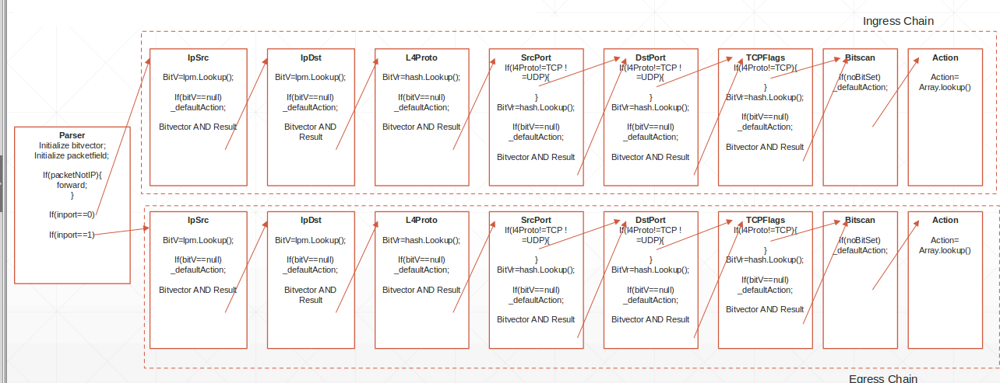

Firewall
========

This service implements a transparent firewall. It can be attached to a port or a netdev, and it may drop or forward each packet that matches one of the defined rules, based on the source and destination IPv4 addresses, level 4 protocol and ports, and TCP flags.
Policy rules can include one or more of the above fields; if a given field is missing, its content does not influence the matching.

**Non-IP packets are always forwarded, without any check**.

Features
--------

Supported features:

  - Matching on following fields:

    - IPv4 source/destination (with prefix match)
    - L4 protocol (TCP/UDP/ICMP)
    - L4 source/destination port
    - TCP Flags
    - Connection tracking status

  - Possible actions:

    - Forward packet from the interface from which it was received to the other
    - Drop packet

  - Non-IP packets are always forwarded
  - Up to 5k rules for each chain (INGRESS/EGRESS)

How to use
----------

Ingress ad egress chains
^^^^^^^^^^^^^^^^^^^^^^^^

The service supports independent _ingress_ and _egress_ policy chains, with two different policy sets:
  - **ingress**: packets that come from the external world and that are try to reach the _inside_ of your network (e.g., in case the firewall is attached to a network device, this refers to packets that are trying to reach your TCP/IP stack);
  - **egress**: packets that come from your inside network and that are trying to reach the external world.

Rule insertion
^^^^^^^^^^^^^^

Rule insertion is guaranteed to be *atomic*: during the computation of the new datapath, the old rule set is used until the new rule set is ready, and only at that moment the new policies will be applied.

Rules can be:
  - **inserted**: the ``insert`` action adds your rule at the _beginning_ of the ruleset (i.e., it becomes the new rule ``0``; existing rules are pushed down).
  - **appended**: the ``append`` action adds your rule at the _end_ of the ruleset (i.e., it becomes the last rule of the ruleset, before the _default_ rule).
  - **update**: the ``update`` action updates a specific rule.
  - **deleted**: the ``delete`` action deletes a specific rule.

Rule insertion is an expensive operation. For this reason, if you are using the REST interface, you can exploit different endpoints to optimize this expensive operation:

  - ``/insert``, ``/delete``, ``/append`` and ``PUT`` on ``rule/<id>`` (update): these endpoints are used to perform a single operation on a rule. As soon as the rule-set is updated, it is compiled and all the modifications are immediately inserted in the datapath.
  - ``/batch``: as suggested by the name, this endpoint is used to perform multiple operation on a single HTTP request. Instead of compiling the new rule-set as soon as a single operation is fulfilled, it waits for all the actions described in the request to be executed. Finally, a single compilation is performed and the datapath is updated once.

Concerning the batch endpoint, it accepts a JSON list of rules like:

.. code-block:: bash

    {
      "rules": [
        {"operation": "insert", "id": 0, "l4proto":"TCP", "src":"192.168.1.1/32", "dst":"192.168.1.10/24", "action":"drop"},
        {"operation": "append", "l4proto": "ICMP", "src":"192.168.1.100/32", "dst":"192.168.1.100/24", "action":"drop"},
        {"operation": "update", "id": 0, "l4proto":"TCP", "src":"192.168.1.2/32", "dst":"192.168.1.20/24", "action":"forward"},
        {"operation": "delete", "id": 0},
        {"operation": "delete", "l4proto":"ICMP", "src":"192.168.1.100/32", "dst":"192.168.1.100/24", "action":"drop"}
      ]
    }

Each element of the ``rules`` array MUST contain an operation (_insert_, _append_, _update_, _delete_) plus a rule/id that represents the actual target of the above operation.
All the listed operation are performed sequentially, hence the user must sent the operations with the appropriate order.
Pay attention when sending some DELETE with other INSERT; you have to take in mind that during such operations IDs may vary (increase or decrease).

This features is also available from the ``polycubectl`` command line. It is strongly suggested to create a JSON file containing the batch of rules and then type:

``polycubectl firewall <fwname> chain <chainname> batch rules= < filename.json``

Using the redirection diamond you are able to insert the file content in the body of the HTTP POST request generated from the command.

Default action
^^^^^^^^^^^^^^

The default action if no rule is matched is **FORWARD**. This can be changed for each chain independently by issuing the command
``polycubectl firewall fwname chain INGRESS set default=DROP`` or ``polycubectl firewall fwname chain EGRESS set default=DROP``.

Statistics and firewall status
^^^^^^^^^^^^^^^^^^^^^^^^^^^^^^

The service tracks the number of packets and the total bytes that have matched each rule.
Statistics can be seen by issuing the command ``polycubectl firewall fw chain INGRESS stats show`` (where ``fw`` is the name of your firewall instance); follow the help for further details.
To flush all the statistics (i.e. both packets and bytes count for every rule) about a chain, issue the following command ``polycubectl firewall fw chain INGRESS reset-counters``.

Additional statistics and status information can be shown with the command ``polycubectl firewall fw show`` (where ``fw`` is the name of your firewall instance); for instance, in case the connection tracking is enabled, this shows also all the TCP/UDP sessions that are currently active in the firewall.

Connection tracking and stateful operations
^^^^^^^^^^^^^^^^^^^^^^^^^^^^^^^^^^^^^^^^^^^
This firewall supports stateful operations, e.g., it allows a to set a FORWARD rule for a given traffic in a given direction (e.g., allow incoming connection on port 22, to enable reaching your local SSH server), and automatically accept also the packets that are generated in the opposite direction and that relate to the above rule.

The connection tracking is enabled by default; its status can be inspected with command ``polycubectl firewall fw show``, which shows also the status of all the TCP/UDP sessions that are currently active in the firewall.
This behavior can be changed with the command ``polycubectl fw1 set accept-established=OFF``.

Connection tracking can still be used, even if the global command apparently set it to OFF, by selectively enabling this feature on a given subset of traffic.
For instance, the above command:

..

  polycubectl fw1 chain EGRESS append l4proto=TCP sport=22 conntrack=ESTABLISHED action=FORWARD

will accept all TCP packets that come from source port 22 (i.e., a local SSH server) and whose connection status is ESTABLISHED. This means that a packet had to be received by your host on port 22, your local server has accepted the connection, hence the packets generated in the opposite direction (i.e., EGRESS) are forwarded.

Examples
--------

First simple examples: enabling SSH connection to your host
^^^^^^^^^^^^^^^^^^^^^^^^^^^^^^^^^^^^^^^^^^^^^^^^^^^^^^^^^^^
Here there is a simple (but complete) example, which allows a given machine:
  - to connect to the Internet and browse HTTPS sites (and nothing else)
  - to accept SSH connections from the Internet (and nothing else)
  - to resolve DNS names (UDP port 53 is enabled in both directions)
  
We assume that the  machine has a network card named ``enp0s3``.

..

  # Create firewall
  polycubectl add firewall fw1
  
  # Attach firewall to the network card (enp0s3)
  polycubectl attach fw1 enp0s3
  
  # Set default action to DROP for both INGRESS and EGRESS chains
  polycubectl fw1 chain INGRESS set default=DROP
  polycubectl fw1 chain EGRESS set default=DROP
  
  # Enable incoming connections on port 22 (to ssh to my server from the external world)
  polycubectl fw1 chain INGRESS append l4proto=TCP dport=22 action=FORWARD
  
  # Enable outgoing connections on port 443 (to connect to HTTPS servers from my machine)
  polycubectl fw1 chain EGRESS append l4proto=TCP dport=443 action=FORWARD
  
  # Enable port 53 in both directions (to enable name resolution)
  polycubectl fw1 chain INGRESS append l4proto=UDP sport=53 action=FORWARD
  polycubectl fw1 chain EGRESS append l4proto=UDP dport=53 action=FORWARD
  
  # Enable established connections to go through, independently from the port they're using
  # Instead of the above two commands, we can use a single default command, i.e. 
  #    polycubectl fw1 set accept-established=ON
  polycubectl fw1 chain INGRESS append l4proto=TCP conntrack=ESTABLISHED action=FORWARD
  polycubectl fw1 chain EGRESS append l4proto=TCP conntrack=ESTABLISHED action=FORWARD
  
  # Show statistics for the INGRESS chain of the firewall
  polycubectl fw1 chain INGRESS show
    
  # Show general statistics for the firewall (e.g., the current ongoing sessions)
  polycubectl fw1 show
  
  # Remove the firewall
  polycubectl del fw1

More examples
^^^^^^^^^^^^^

The `examples source folder <https://github.com/polycube-network/polycube/tree/master/src/services/pcn-firewall/examples/>`_ contains some simple scripts to show how to configure the service.

Also under the test directory, there are plenty of scripts that test the firewall using both single and batch rule insertion/deletion.

Implementation details
----------------------

Data plane - fast path
^^^^^^^^^^^^^^^^^^^^^^

Currently eBPF does not support maps with ternary values (i.e., *wildcard maps*), this forced to implement an algorithm that could offer this functionality and support a large number of rules, the **Linear Bit Vector Search**, that is particularly suitable to be implemented in eBPF and modularized using tail calls, but has an O(NRules) complexity.

A first module parses the packet and sends it to the ingress or egress chain. Each chain has a series of eBPF programs that evaluate one single field, compute the bit vector (in linear time) and sends the packet to the next module. The second-to-last module uses the *De Bruijn sequence* to perform a first bit set search, and based on the results calls the next module that performs the actual action on the packet.

Each module is injected only if the rule set requires it (for example, if no rule requires matching on IP source, the module in charge of doing it is not injected).
The rule limit and the O(N) complexity is given by the bit vector computation, that requires a linear search of the array, performed using loop unrolling.

An overview of the algorithm is depicted in the figure below.

Control Plane
-------------

Code structure
^^^^^^^^^^^^^^

The control plane is in charge of managing each eBPF module. The code has been organized hierarchically to simplify the implementation. The Firewall class acts as a master, it keeps track of all the injected modules. API calls are managed by the ChainRule and Chain classes. Each module is represented in the control plane by a class inheriting from the Program interface, and encapsulates the eBPF module management, offering uniform interfaces to inject or remove the module or interact with its tables. This structure has the advantage of masking a number of MACROS present in the bpf code that are substituted at run-time based on the configuration, for example the number of rules.

Rules computation
^^^^^^^^^^^^^^^^^

The Linear Bit Vector Search requires computing tables of bit vectors, where each table represent a field, each row represents a value for that field and the matched rules in the form of a bit vector (where the Nth bit is 1 if the rule is matched, 0 if not).
Considering the complexity of the operation, the choice was to compute the tables from zero each time a rule is modified.

