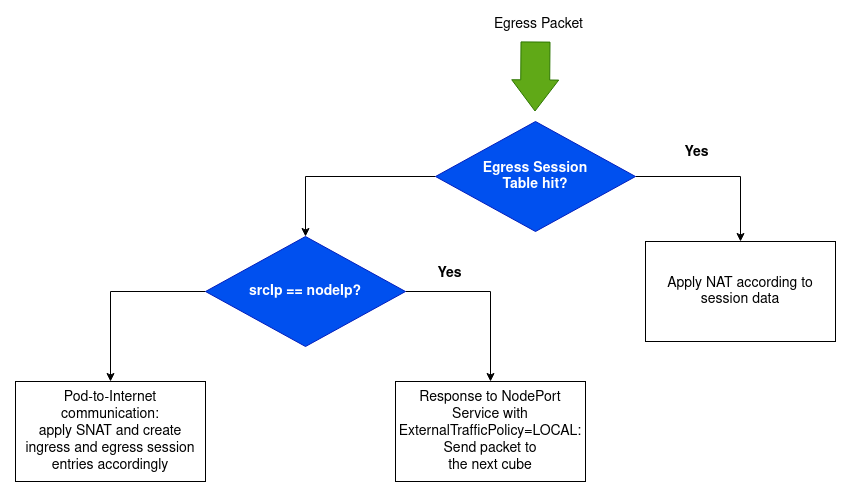
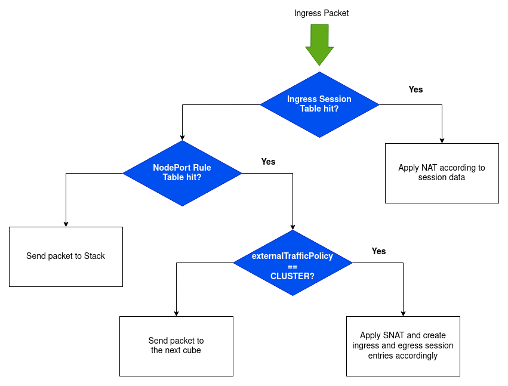

# K8dispatcher

The ``pcn-k8sdispatcher`` service is specifically designed as part of our Kubernetes networking solution (please see [polykube](https://github.com/polycube-network/polykube) to get more information about it). The service provides an eBPF implementation of a custom NAT: it performs different actions depending on the type and on the direction of the traffic.

For Egress Traffic, the following flow chart can be used to explain the functioning of the service:

The Egress Traffic is the traffic generated by Pods and directed to the external world.
This traffic can be generated by an internal Pod that wants to contact the external world or as a response to an
external world request. For this traffic, the service maintains an egress session table containing information
about the active egress sessions. The first time a Pod wants to contact the external world, no active egress session
will be present in the table: in this scenario, the service performs SNAT, replacing the address of the Pod
with the address of the node, and creates entries in the ingress and egress session table accordingly.
If the outgoing traffic is generated as a response to an external request, it can only be originated as a response to
a request made to a NodePort Service. For traffic related to NodePort Services with a CLUSTER ExternalTrafficPolicy,
if an egress session table hit happens, the destination IP address and port are replaced accordingly to the session data.
The traffic related to NodePort Services with a LOCAL ExternalTrafficPolicy is forwarded as it is to the next cube.

For Ingress Traffic, the following flow chart can be used to explain the functioning of the service:

The Ingress Traffic can be differentiated in traffic directed to the host (either directly or because it needs VxLAN
processing) and traffic directed to Pods. The traffic directed to Pods can be the traffic generated by an external host
trying to contact a NodePort service or the return traffic generated by an external host providing a response to an
internal Pod request. The service uses an ingress session table containing all the active ingress sessions. 
If a session table hit happens, the service apply NAT according to the session data. If no session table entry is
associated with the incoming packet, the service tries to determine if a NodePort rule matches the packet
characteristics. In case of no NodePort rule matching, the packet is sent to the Linux stack for further processing.
In case of NodePort rule matching, different actions are applied according to the ExternalTrafficPolicy of the
Kubernetes NodePort Service associated to the rule. If the policy is LOCAL, the traffic is allowed to reach only
backend Pods located on the current node: in this case the packet can proceed towards the Pod without modifications.
In case the policy is CLUSTER, the packet can also reach backend Pods located on other nodes: since later in
the chain the packet will be processed by a load balancer and the return packet will have to transit through
the same load balancer, SNAT is applied by replacing the source IP address with a specific reserved address belonging
to the Pod CIDR of the node on which the k8sdispatcher is deployed. In this way the two nodes (the one that
receives the request and the one running the selected backend Pod) will exchange the packets of the flow over
the VxLAN interconnect. In this latter case, corresponding session entries are stored into the ingress and egress
sessions tables.