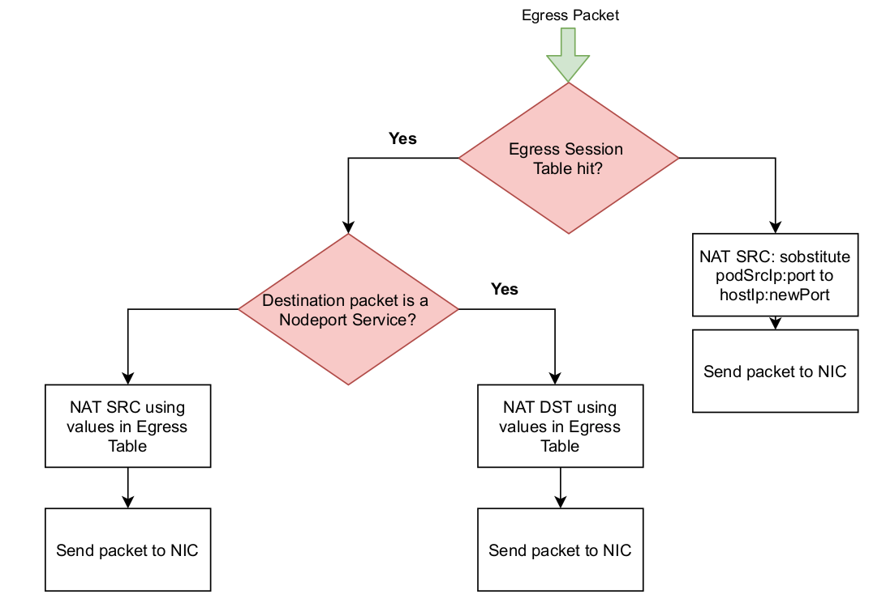
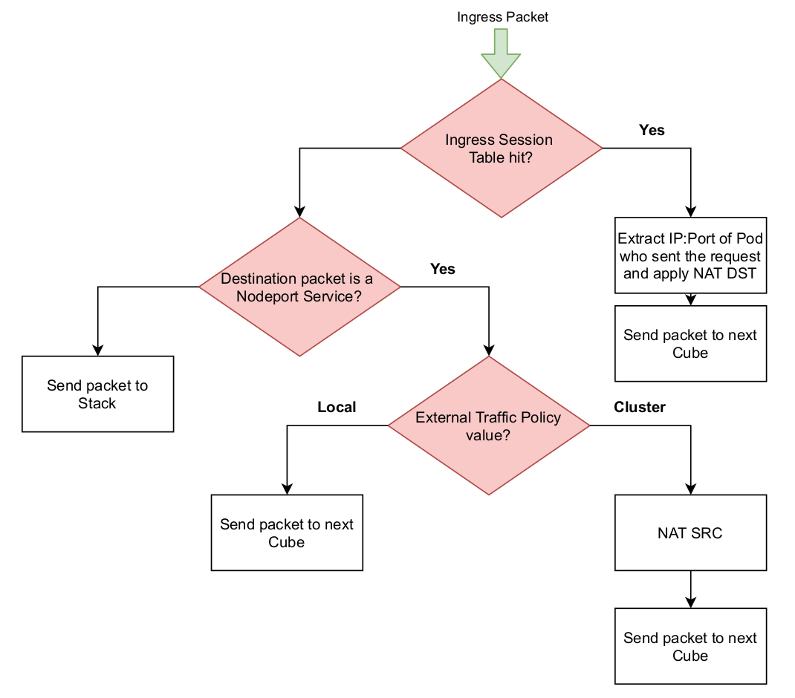

# K8dispatcher

The ``pcn-k8sdispatcher`` service is specifically designed as part of our kubernetes
networking solution (please see [polykube](https://github.com/polycube-network/polykube) to get more information about
it). The service provides an eBPF implementation of a custom NAT: it
performs different actions depending on the type and on the direction of the traffic.

For Egress Traffic, the following flow chart can be used to explain the functioning
of the service:

The Egress Traffic is the traffic generated by Pods and directed to the external
world. This traffic can be generated by an internal Pod that want to contact the
external world or as a response to an external world request. For this traffic, the
service maintains an egress session table containing information about the active
egress sessions. If a Pod want to contact the external world, no active egress session
will be present in the table: in this scenario, the service performs SNAT, replacing
the address of the Pod with the address of the node, and adds an entry to the
egress session table. If the outgoing traffic is generated as a response to an external
request, an egress session table hit will happen: in case of traffic generated as a
response for a request to a NodePort Service, DNAT is performed; otherwise SNAT
is performed. In both the latter two cases, NAT is performed using the information
retrieved from the egress session table.

For Ingress Traffic, the following flow chart can be used to explain the functioning
of the service:

The Ingress Traffic can be differentiated in traffic directed to the host (either
directly or because it needs VxLAN processing) and traffic directed to Pods. The
traffic directed to Pods can be the traffic generated by an external host trying
to contact a NodePort service or the return traffic generated by an external host
in order to provide a response to an internal Pod request. The service uses an
ingress session table containing all the active ingress sessions. If a session table
hit happens, the service performs DNAT by replacing <NodeIP>:<Port> of the
packet with <PodIP>:<PodPort> extracted from the ingress session table entry.
If no session table are associated with the incoming packet, the service try to
determine if a NodePort rule matches the packet characteristics. In case of no
NodePort rule matching, the packet is sent to the Linux stack for further processing.
In case of NodePort rule matching, different actions are applied according to the
ExternalTrafficPolicy of the Kubernetes NodePort Service associated to the
rule. If the policy is LOCAL, the traffic is allowed to reach only backend Pods
located on the current node: in this case the packet can proceed towards the Pod
without modifications. In case the policy is CLUSTER, the packet can also reach
backend Pods located on other nodes: since later in the chain the packet will be
processed by a load balancer and the return packet will have to transit through
the same load balancer, SNAT is applied by replacing the source IP address with
a specific reserved address belonging to the Pod CIDR of the node on which the
k8sdispatcher is deployed. In this way the two nodes (the one that receives the
request and the one running the selected backend Pod) will exchange the packets
of the flow over the VxLAN interconnect. In this case, a corresponding session
entry is stored into the ingress sessions table.