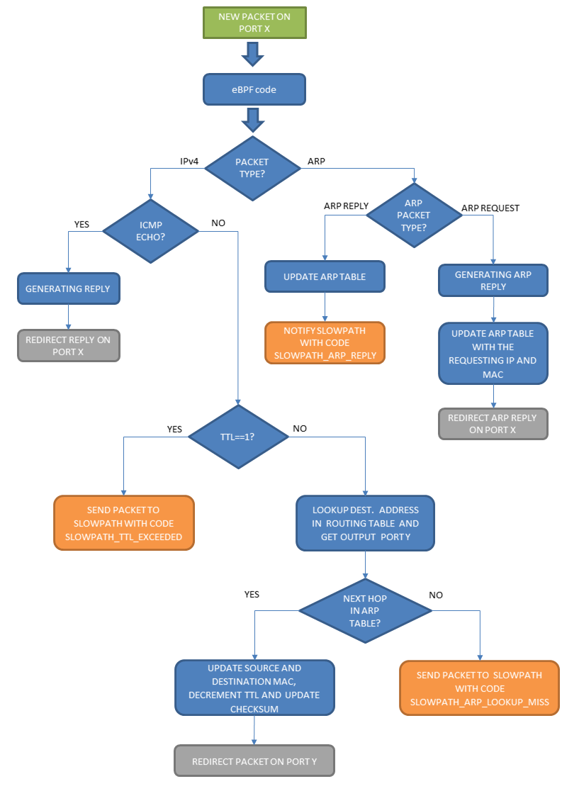
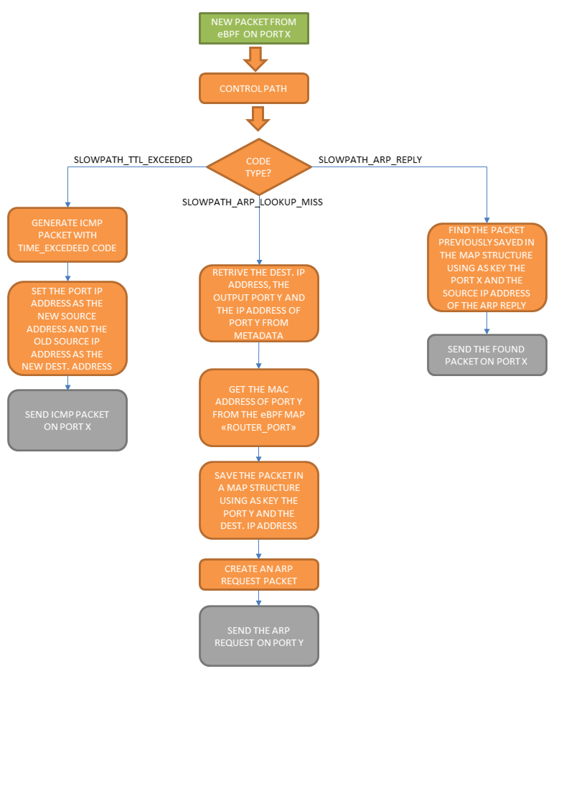

# Router

This service implements an IPv4 router.

## Features

- IPv4 addresses and routes
- Only static routes are supported
- Up to 5 secondary addresses per interface
- Handling of ARP packets
- IPv6 and VLANs are not supported

## How to use

### Important note about MAC filtering on physical NICs

When setting up the router connected to a physical interface, remember to set the MAC address of that router interface equal to the MAC address of the physical NIC.
This allows the frames that come into the pcn-router to have the same MAC address of the physical interface, which will allow the frame to go through. Otherwise, the NIC may discard incoming frames because of the wrong MAC destination address, hence the traffic will never reach the router interface.
This is especially important if your setup is based on a Virtual Machine: virtual NICs have often unpredictable behavior which depends also on the hypervisor in use; hence, tricks such as putting the virtual NIC in `promiscuous mode` may not work in this case, forcing the user to set the proper MAC address on the pcn-router port.

### Examples

Please see [Tutorial 2](../../tutorials/tutorial2/tutorial2).

## Implementation details

### Data plane - fast path

This flowchart summarizes the fast path algorithm of the router, which is implemented in [Router_dp.c](https://github.com/polycube-network/polycube/blob/master/src/services/pcn-router/src/Router_dp.c).

### Data plane - slow path

This flowchart summarizes the slow path algorithm of the router, which is implemented in the control plane ([source code](https://github.com/polycube-network/polycube/blob/master/src/services/pcn-router/src/)).

