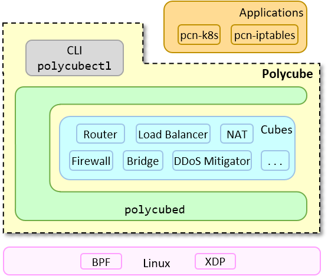

# Polycube

``Polycube`` is an **open source** software framework that provides **fast** and **lightweight** **network functions** such as bridges, routers, firewalls, and others.

Polycube services, called `cubes`, are based on the recent `BPF` and `XDP` Linux kernel technologies and hence are extremely **efficient**. In addition, cubes are easily **extensible** and **customizable**.
Available cubes include `bridge`, `router`, `nat`, `load balancer`, `firewall`, `DDoS mitigator`, and more.

Cubes can be composed to build arbitrary **service chains** and provide custom network connectivity to **namespaces**, **containers**, **virtual machines**, and **physical hosts**.
Polycube networks can be controlled by a coherent, uniform and simple command line, named `polycubectl`, which interacts with a REST-based daemon, `polycubed`.

Polycube provides also some proof-of-concept **complex applications** based upon this framework, such as `pcn-k8s`, a brand new network plug-in for *Kubernetes*, which can handle the network of an entire datacenter and that outperforms existing solutions, and `pcn-iptables`, a much more efficient clone of *iptables*.

A brief overview of the Polycube layered structure is shown in the picture below.

 

**End users** can leverage the already available cubes to *create*, *configure* and *control* complex network services in their hosts.
**Service developers**, instead, can create new network services by leveraging the power of the Polycube framework, which takes care of handling most of the glue logic needed for the service to operate. Operations such as data handling and validation and the entire REST interface are automatically generated, while other tasks such as interactions with the data plane running in the kernel are greatly simplified. This enables developers to concentrate on the main logic of their services, leaving the rest to Polycube.

## Getting Started
 - [What is Polycube?](#Polycube)
 - [Quickstart](Documentation/quickstart.rst)
 - [Documentation](Documentation)
 - [pcn-k8s - Kubernetes network provider](Documentation/components/k8s/pcn-kubernetes.rst)
 - [pcn-iptables - Iptables clone](Documentation/components/iptables/pcn-iptables.rst)
 - [Contributing]()

## Main features

### Extremely fast
Polycube enables extremely fast and efficient network services, thanks to its capability to run inside the Linux kernel and, whenever possible, as close as possible to the network interface card driver, which reduces the time spent in ancillary components. 

### Service chaining
Polycube supports the definition of multiple network scenarios through the composition of many elementary building blocks (i.e., *cubes*),  which can be combined (e.g., attached one to the other) to create complex network services.
For instance, several dockers can communicate through a bridge, which is then attached to a router to provide internet connectivity (possibly through a nat), while a firewall protects the entire infrastructure.

Polycube has been designed to simplify service chaining: cubes can be dynamically instantiated and seamlessly connected together using virtual links, mimicking traditional networks in which dedicated middlebox are connected with each other through physical wires.
As a consequence, cubes can be composed to build arbitrary service chains and provide custom network connectivity to namespaces, docker, virtual machines, and physical hosts.

### Production-grade network services
Polycube greatly simplifies the way data, control, and management planes communicate, hence enabling the creation of rich network services that include all the above features.
In turn, this offers a simplified environment to service developers, who can leverage the power of Polycube to write the data/control and management parts of their network services.

In detail, most network services include a *data plane*, such as the longest prefix match algorithm in a router, a *control plane*, e.g., where routing protocols are executed, and a *management plane*, devoted to the configuration and monitoring of the service.
`bpf` aims at the creation of fast data planes, leaving the rest under the responsibility of the developer; Polycube overcomes this limitation with a rich set of primitives natively provided by the framework.
In addition, Polycube provides the software infrastructure required to overcome possible limitations of BPF in the data plane (e.g., the limited size of data plane programs), enabling the steering of packets that require complex processing in user-space, where previous limitations doesn't apply.

### Single point of control
Polycube provides a single point of control to the entire virtual network, including all the running services.
Its unified command line interface enables the *setup* of the virtual infrastructure, it *instantiates* new services and connect them properly, handles the *lifecycle* of all running cubes, and supports the *configuration* and *monitoring* of all the running elements.

This is achieved by a unified command line interface ( `polycubectl`) that interacts with a REST-based daemon (`polycubed`) in charge of the supervision of the entire infrastructure.
In addition, Polycube implements a *service agnostic* configuration mechanism, based on YANG data models and the RESTCONF protocol, in which new services can seamlessly develop and dynamically added to the framework, with the command line being automatically able to handle the above services without any modification.

### Outstanding performance with real applications
Two complex applications have been released to show the potential of Polycube, ``pcn-iptables`` and ``pcn-k8s``.

- `pcn-iptables`: The former is a clone of **iptables** that is able to filter packets passing through a Linux host, demonstrating how packet filtering can be achieved with impressive performance, while at the same time guaranteeing the same command line and the same external behavior of the original software.
- `pcn-k8s`: The latter is a network plug-in for **Kubernetes**, i.e., a software that handles the entire virtual network of a Kubernetes cluster, which includes bridging, routing, NAT, load balancing and tunneling services. Our plug-in has been tested for scalability and guarantees outstanding performance in terms of network throughput.

## Powered by eBPF and XDP

`BPF` and `XDP` are the main Linux kernel technologies on which `Polycube` is based. `BPF` supports dynamic code injection in the Linux kernel at runtime, enabling the dynamic creation of a data plane. The `BPF` data plane has a minimal feature set which avoids processing overhead and is exactly tailored to user needs.

- `bpf` (Extended Berkeley Packet Filter) code is dynamically compiled and injected, checked for safety to avoid any hazard in the kernel, while efficiency is achieved thanks to a just-in-time compiler (JIT) that transforms each instruction into a native 64-bit (x64) code for maximum performance.
- `XDP` (eXpress Data Path) provides a new way to intercept network packets very early in Linux network stack, with a significant gain in performance thanks to the possibility to avoid costly operations such as `skbuff` handling.

## Licence
Polycube is licensed under the Apache License, Version 2.0 (ALv2)
